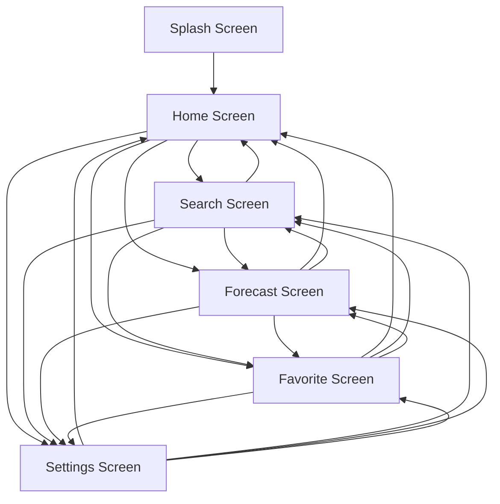

# Member 1 - UI & Navigation Developer

## 1. Mục tiêu

Phần việc của Member 1 tập trung vào giao diện tổng thể, luồng điều hướng và bố cục responsive cho ứng dụng Android_UTH_02 - Weather Viewing App. Giao diện được thiết kế theo Material Design 3, ưu tiên dễ đọc, thao tác nhanh và phù hợp với nội dung thời tiết.

## 2. Nguyên tắc Material Design

- Sử dụng `MaterialTheme`, `Scaffold`, `TopAppBar`, `NavigationBar`, `ElevatedCard`, `Button`, `OutlinedTextField`, `Switch`.
- Màu chính dùng từ theme của ứng dụng, hỗ trợ light/dark mode và dynamic color trên Android 12+.
- Các nhóm thông tin thời tiết được đặt trong card bo góc 8dp để dễ quét nội dung.
- Nút và mục điều hướng đều có icon rõ nghĩa: Home, Search, Forecast, Favorite, Settings.
- Khoảng cách nội dung dùng padding 16dp, các item cách nhau 12-16dp để giao diện thoáng trên điện thoại.

## 3. Wireframe các màn hình

### 3.1 Splash Screen

```text
+--------------------------------+
|                                |
|              Cloud             |
|                                |
|          Weather View          |
| Real-time weather for places   |
|                                |
+--------------------------------+
```

Chức năng:

- Hiển thị logo/icon thời tiết.
- Hiển thị tên ứng dụng.
- Tự chuyển sang Home Screen sau thời gian loading ngắn.

### 3.2 Home Screen

```text
+--------------------------------+
| Top App Bar: Home       S  Set |
+--------------------------------+
| Ho Chi Minh City         Cloud |
| Partly cloudy                  |
| 31°C                           |
| [View 5-day forecast]          |
+--------------------------------+
| Humidity | Wind                |
| Pressure | Feels like          |
+--------------------------------+
| Today                          |
| 09:00 29°C | 12:00 32°C ...   |
+--------------------------------+
| Home Search Forecast Fav Set   |
+--------------------------------+
```

Chức năng:

- Hiển thị thời tiết hiện tại.
- Hiển thị các chỉ số: độ ẩm, gió, áp suất, cảm giác thực tế.
- Có nút chuyển nhanh sang Forecast Screen.

### 3.3 Search Screen

```text
+--------------------------------+
| Top App Bar: Search     S  Set |
+--------------------------------+
| [Search city                 ] |
| [Use current location]         |
|                                |
| Da Nang                 [Add]  |
| Ha Noi                  [Add]  |
| Can Tho                 [Add]  |
+--------------------------------+
| Home Search Forecast Fav Set   |
+--------------------------------+
```

Chức năng:

- Nhập tên thành phố.
- Hiển thị danh sách gợi ý.
- Có nút dùng vị trí hiện tại.
- Có nút thêm thành phố vào danh sách yêu thích.

### 3.4 Forecast Screen

```text
+--------------------------------+
| Top App Bar: Forecast   S  Set |
+--------------------------------+
| 5-day forecast                 |
| Monday      Cloudy      27/33  |
| Tuesday     Light rain  26/31  |
| Wednesday   Sunny       28/34  |
| Thursday    Storm       25/30  |
| Friday      Cloudy      27/32  |
+--------------------------------+
| Home Search Forecast Fav Set   |
+--------------------------------+
```

Chức năng:

- Hiển thị dự báo 5 ngày.
- Mỗi dòng có ngày, trạng thái thời tiết và nhiệt độ thấp/cao.

### 3.5 Favorite Screen

```text
+--------------------------------+
| Top App Bar: Favorite   S  Set |
+--------------------------------+
| Favorite locations             |
| Ho Chi Minh City  Cloudy 31°C  |
| Da Nang           Sunny  30°C  |
| Ha Noi            Rain   28°C  |
+--------------------------------+
| Home Search Forecast Fav Set   |
+--------------------------------+
```

Chức năng:

- Hiển thị danh sách địa điểm yêu thích.
- Chuẩn bị giao diện để Member 5 nối local storage.

### 3.6 Settings Screen

```text
+--------------------------------+
| Top App Bar: Settings   S  Set |
+--------------------------------+
| Preferences                    |
| Temperature unit       [ON]    |
| Celsius (°C)                   |
| Weather alerts         [OFF]   |
| Receive daily reminders        |
+--------------------------------+
| Home Search Forecast Fav Set   |
+--------------------------------+
```

Chức năng:

- Bật/tắt đơn vị Celsius/Fahrenheit.
- Bật/tắt thông báo thời tiết.
- Chuẩn bị giao diện để Member 6 nối chức năng settings.

## 4. Sơ đồ Navigation



Luồng chính:

1. Người dùng mở ứng dụng.
2. Splash Screen hiển thị trong thời gian ngắn.
3. Ứng dụng chuyển sang Home Screen.
4. Người dùng điều hướng bằng Bottom Navigation hoặc nút trên Top App Bar.

## 5. Responsive Layout

- Sử dụng `LazyColumn` để màn hình cuộn tốt trên máy nhỏ.
- Nội dung chính có padding ngang 16dp để tránh sát cạnh màn hình.
- Các chỉ số thời tiết dùng `FlowRow`, tự xuống dòng khi màn hình hẹp.
- Card dùng `fillMaxWidth()` cho danh sách và chiều rộng cố định hợp lý cho metric card.
- Dùng `WindowInsets.safeDrawing` để tránh nội dung bị che bởi status bar/navigation bar.
- Typography dùng Material Theme, không cố định kích thước theo pixel.

## 6. Hỗ trợ cấu hình môi trường phát triển

Checklist cho các thành viên:

1. Cài Android Studio bản mới.
2. Cài Android SDK tương ứng với project.
3. Mở thư mục `CODE` bằng Android Studio.
4. Chờ Gradle Sync hoàn tất.
5. Nếu thiếu JDK, chọn JDK đi kèm Android Studio trong `Settings > Build Tools > Gradle`.
6. Chạy app bằng emulator hoặc điện thoại Android đã bật USB Debugging.
7. Nếu module API cần key, tạo file cấu hình riêng và không commit API key lên Git.
8. Trước khi push code, chạy `gradlew.bat assembleDebug` để kiểm tra build.

## 7. Phần code đã chuẩn bị

- File chính: `CODE/app/src/main/java/com/example/android_uth_02_weather_viewing_app_group6/MainActivity.kt`
- UI hiện có: Splash, Home, Search, Forecast, Favorite, Settings.
- Navigation hiện có: điều hướng bằng state trong Compose, có Bottom Navigation và action trên Top App Bar.
- Dữ liệu hiện tại: dữ liệu mẫu để các member khác nối API, location, local storage và settings sau.

